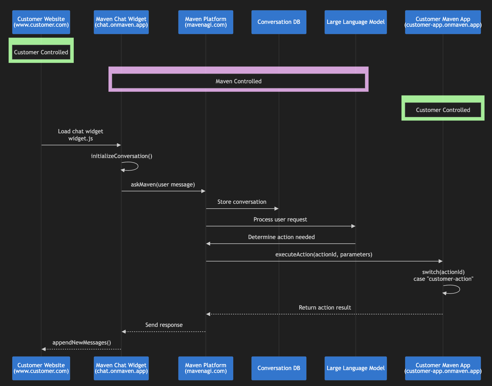

# Getting Started Guide for Developers

Welcome to the Maven AGI Developer Platform! We're excited to support you in building custom apps that run on top of Maven. This guide will walk you through everything you need to know to start building and deploying your own Maven Apps.

---

## 1. Key Concepts: Maven Apps, Agents, and Repositories

Before diving in, here are a few concepts to understand:

* **Maven App**: A TypeScript-based application that integrates with the Maven platform and extends its capabilities.
* **Maven Agent**: A runtime environment within your organization that runs one or more installed Maven Apps. Organizations typically have separate agents for staging and production.
* **GitHub Repositories**: Each Maven App is managed in its own GitHub repo. For production-ready flows, staging and production apps live in separate repositories and are independently deployed (automatic deployment triggered on changes to the `main` branch).

### Solution Architecture

The following diagram shows how your Maven app integrates with your website and the Maven platform:



**Green components** = You control and implement these  
**Purple components** = Maven platform infrastructure

---

## 2. Prerequisites

Before you begin developing Maven Apps, ensure you have:

- **[Node v22.11.0](https://nodejs.org/dist/v22.11.0/node-v22.11.0.pkg)** or later
- **pnpm**: Install with `brew install pnpm` ([brew installation guide](https://brew.sh/))
- **TypeScript**: `pnpm add typescript -D`
- **Code Editor**: [Visual Studio Code](https://code.visualstudio.com/) or your preferred IDE
- **Optional**: [tsx](https://tsx.is/) for convenient TypeScript execution

---

## 3. Choose Your Development Workflow

Depending on where you are in your development journey with Maven AGI, you can choose between two workflows:

* **Option 1: Sandbox / Demo Development**
  Ideal for early-stage experimentation, internal demos, or lightweight prototyping. This workflow uses a single repository and allows fast iteration without staging or deployment gates.

* **Option 2: Production-Ready Development**
  Designed for stable, customer-facing applications. This workflow includes structured staging validation and a promotion path from your staging app to your production app.

| If you're...                      | Use this path                 |
| --------------------------------- | ----------------------------- |
| Just exploring or demoing         | Option 1: Sandbox Workflow    |
| Building a real app for end users | Option 2: Production Workflow |


---

## 4. Option 1: Sandbox / Demo Development

This path is designed for fast iteration with minimal setup. Great for testing and non-critical demos.

**Repository Used:**

* `private-acme-app` (single app repository for all changes)

**Use Cases:**

* Internal demos
* Prototyping
* POCs

### Step-by-Step Instructions

1. **Access Your GitHub Repo**
   Your Maven contact will grant access to `private-acme-app`.

2. **Clone the Repository**

   ```bash
   git clone git@github.com:your-org/private-acme-app.git
   cd private-acme-app
   pnpm install
   ```

3. **Create a Feature Branch**

   ```bash
   git checkout -b sandbox/new-feature
   ```

4. **Develop Your App**

   * Modify code using your IDE or App Studio
   * Use development commands:

     ```bash
     pnpm build      # Compile and lint
     pnpm test       # Run unit tests
     pnpm dev        # Run dev server if applicable
     ```

5. **Push and Merge**

   ```bash
   git add .
   git commit -m "feat: add demo feature"
   git push origin sandbox/new-feature
   ```

   * Open a PR from `sandbox/new-feature` into `main`
   * Merge when ready

6. **Deploy Immediately**

   * Changes to `main` automatically trigger deployment to your sandbox agent (no staging involved)

**Note:** This path bypasses formal testing. Avoid using it for production workflows.

---

## 5. Option 2: Production-Ready Development

This path is recommended for building customer-facing Maven apps with validation and promotion controls.

### Repositories, Apps, and Environments

You will work with **two separate Maven apps**, each managed in its own GitHub repository and deployed independently:

- **`private-acme-develop`**  
  This repository contains your **staging Maven app**, used for development and testing.  
  It is installed on your organization's **staging Maven agent**.

- **`private-acme-app`**  
  This repository contains your **production Maven app**, used in live customer-facing environments.  
  It is installed on your organization's **production Maven agent**.

### Step-by-Step Instructions

1. **Access Your GitHub Repos**
   Your Maven contact will give you access to both `private-acme-develop` and `private-acme-app`.

2. **Clone the Development Repo**

   ```bash
   git clone git@github.com:your-org/private-acme-develop.git
   cd private-acme-develop
   pnpm install
   ```

3. **Create a Feature Branch**

   ```bash
   git checkout -b new-feature-branch
   ```

   While no automatic testing or CI/CD will be triggered by pushes to feature branches, PRs are suggested to share contributions amongst team members and organize changes to the repository over time as your Maven application evolves.

4. **Set Up Local Development**

   * Create a `.env.local` with required secrets
   * Build and test locally using:

     ```bash
     pnpm build
     pnpm test
     pnpm dev
     ```

5. **Commit and Push**

   ```bash
   git add .
   git commit -m "feat: add new postback action"
   git push origin new-feature-branch
   ```

6. **Open a Pull Request**

   * PR: `new-feature-branch` → `main` in `private-acme-develop`
   * Review and merge once approved

7. **Deploy to Staging**

   * Changes to `private-acme-develop/main` automatically trigger deployment to your staging Maven agent

8. **Validate in Staging**

   * Run tests and verify functionality

9. **Promote to Production**

   * Open a PR from `private-acme-develop/main` → `private-acme-app/main`
   * Merge to `private-acme-app/main` automatically triggers production deployment

10. **Validate in Production**

    * Confirm functionality on the live production agent

11. **Sync Dev with Prod**

    ```bash
    git checkout main
    git pull upstream main  # Assuming upstream is private-acme-app
    ```

    Or use GitHub's "Sync fork" button

---

## 6. What's in a Maven App (Project Structure)

```
your-app/
├── settings.d.ts          # App configuration interface
├── src/
│   ├── index.ts           # Main entry point (preInstall, postInstall, executeAction)
│   ├── lib/
│   │   └── actions.ts     # Action implementations
│   └── __tests__/         # Unit tests
├── package.json           # Dependencies and scripts
├── .env.local             # Local env variables (not committed)
└── vitest.config.js       # Unit test config
```

---

## 7. Essential Commands

```bash
pnpm install   # Install dependencies
pnpm build     # Build and lint
pnpm test      # Run unit tests
pnpm dev       # Start development server (if app has UI)
```

---

## 8. Testing Your App (Unit + Staging)

* Use **Vitest** for unit testing core functionality
* Push changes to `private-acme-develop/main` (automatically deploys) and test via your staging agent for integration coverage
* Validate both success and edge cases

Example test patterns are available in [Community Gainsight App Tests](https://github.com/mavenagi-apps/community-gainsight/tree/main/src/__tests__).

---

## 9. How a Maven App Works (Hooks + Actions)

### Installation Lifecycle

1. `preInstall`: Validate configuration, credentials, or API access
2. `postInstall`: Register actions and set up resources

### Action Lifecycle

1. **Register Action** (in `postInstall`):

   ```typescript
   await mavenClient.actions.createOrUpdate({
     actionId: { referenceId: 'create_ticket' },
     name: 'Create Support Ticket',
     userInteractionRequired: true,
     userFormParameters: [
       {
         id: 'title',
         label: 'Title',
         required: true,
       },
     ],
   });
   ```

2. **Handle Execution** (in `executeAction`):

   ```typescript
   case 'create_ticket':
     const { title } = parameters;
     return await createTicketInExternalSystem(title);
   ```

---

## 10. Promoting from Dev to Production

* Use cross-repo PR from `private-acme-develop/main` to `private-acme-app/main`
* Merging to `main` automatically triggers deployment to the hosted Maven app
* Validate before and after each deployment
* Roll back by reverting the last commit in `private-acme-app` (this will automatically redeploy the previous version)

---

## 11. Troubleshooting

### Deployment Issues from GitHub

**Workaround if you hit deployment issues from GitHub**: If you encounter any issues with pushed changes triggering deployments, copy your local changes into the web-based App Studio and deploy from there. Here's a couple screenshots showing where App Studio lives in Maven:


---

## 12. Resources & Getting Help

* [Maven Developer Docs](https://developers.mavenagi.com/docs/api-reference/overview/authentication) - Reference full API docs
* [Maven Community Apps](https://github.com/mavenagi-apps/community-gainsight/tree/main) - Check community examples
* [Maven Help Center](https://docs.mavenagi.com/home) - Platform documentation and guides
* [Maven Node.js SDK](https://github.com/mavenagi/mavenagi-node) - TypeScript SDK for Maven platform
* [Maven Discord Community](https://discord.mavenagi.com) - Join the developer community
* Reach out via your Maven team contact for direct support

---

Happy building! 

– The Maven Developer Relations Team