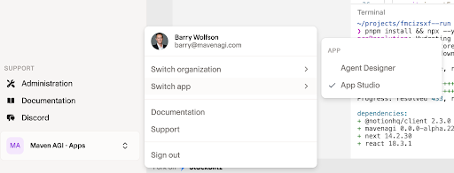
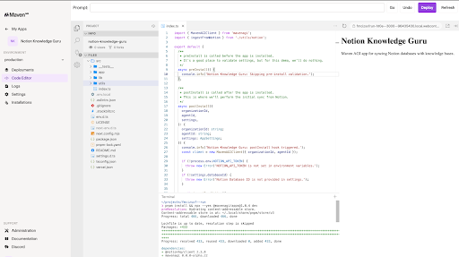

Welcome to the Maven AGI Developer Platform! We're excited to support you in building custom apps that run on top of Maven. This guide will walk you through everything you need to know to start building and deploying your own Maven Apps.

---

## Key Concepts: Maven Apps, Agents, and Repositories

Before diving in, here are a few concepts to understand:

| **Term**              | **Description**                                                                                                                                                                                           |
| --------------------- | --------------------------------------------------------------------------------------------------------------------------------------------------------------------------------------------------------- |
| Maven App             | A TypeScript-based application that integrates with the Maven platform and extends its capabilities.                                                                                                     |
| Maven Agent           | A runtime environment within your organization that runs one or more installed Maven Apps. Organizations typically have separate agents for staging and production.                                       |
| GitHub Repositories   | Each Maven App is managed in its own GitHub repo. You'll create your own repository based on our public template and connect it to Maven's deployment system.                                            |
| Your Maven Contact    | Your Maven contact who will help coordinate the initial setup and configuration of your development environment.                                                                                          |

### Solution Architecture

The following diagram traces the path of a question through the various components involved in a conversation with a Maven agent. 
It highlights the pieces in green which are customer-authored and points out how your custom Maven app plugs into the conversation flow 
enabling extension of the Maven agent's capabilities based on your own enterprise's unique integration requirements.

<Frame caption="Customer App Request Flow">
  
</Frame>

**Green components** = You control and implement these  
**Purple components** = Maven platform infrastructure

---

## Prerequisites

Before you begin developing Maven Apps, ensure you have:

- **[Node v22.11.0](https://nodejs.org/dist/v22.11.0/node-v22.11.0.pkg)** or later
- **pnpm**: Install with `brew install pnpm` ([brew installation guide](https://brew.sh/))
- **TypeScript**: `pnpm add typescript -D`
- **Code Editor**: [Visual Studio Code](https://code.visualstudio.com/) or your preferred IDE
- **Optional**: [tsx](https://tsx.is/) for convenient TypeScript execution

---

## Initial Setup Process

The new Maven AGI development workflow allows you to create and manage your own GitHub repository while working closely with your Solution Engineer (SE) to get everything configured properly.

### Overview of the Process

<Steps toc={true}>
  <Step title="Create Your Repository">
    Start with our public template in your own GitHub organization
  </Step>

  <Step title="Install Maven GitHub App">
    Connect your repo to Maven's deployment system
  </Step>
  
  <Step title="Coordinate with Your Maven Contact">
    Share your repository URL with your Maven contact and they will configure the app in Maven's App Studio
  </Step>

  <Step title="Deploy and Test">
    Push changes and see them deployed automatically
  </Step>
</Steps>

<Note>
**Naming Convention**: Throughout this guide, we'll use `acme-production` as an example repository name. Replace this with your own descriptive repository name.
</Note>

---

## Step-by-Step Setup Instructions

### Create Your Repository from Template

<Steps toc={true}>
  <Step title="Navigate to the Maven AGI Template">
    Go to the public [Maven AGI Template Repository](https://github.com/mavenagi-apps/template-api) on GitHub.

    <Frame caption="Create New Repo Using Template">
      
    </Frame>
  </Step>

  <Step title="Create a New Repository">
    Click "Use this template" and create a new repository in your own GitHub organization.

    <Frame caption="Create New Repo in Own Org">
      
    </Frame>
  </Step>
</Steps>

### Install the Maven AGI GitHub App

<Steps toc={true}>
  <Step title="Navigate to the Maven AGI GitHub App">
    Go to [https://github.com/apps/maven-agi](https://github.com/apps/maven-agi)

    <Frame caption="Install Maven GitHub App">
      
    </Frame>
  </Step>

  <Step title="Configure the Installation">
    * Select your GitHub organization
    * Choose to install only on the specific repository you just created

    <Frame caption="Configure GitHub App Own Org">
      
    </Frame>
  </Step>

  <Step title="Verify Installation">
    After installation, you should see the Maven AGI app listed in your repository's settings.

    <Frame caption="Post Maven GitHub App Install">
      
    </Frame>
  </Step>
</Steps>

### Coordinate with Your Maven Contact

<Steps toc={true}>
  <Step title="Share Your Repository URL">
    Send the URL of your newly created GitHub repository to your Maven contact.
  </Step>

  <Step title="Wait for Configuration">
    Your Maven contact will:
    * Create the app in Maven's App Studio
    * Configure it to use your GitHub repository
    * Set up the deployment pipeline
  </Step>
</Steps>

### Test Your First Deployment

<Steps toc={true}>
  <Step title="Make a Test Change">
    Once your Maven contact has configured everything, make a small change to your repository and push it to the `main` branch.

    <Frame caption="Commit Change">
      
    </Frame>
  </Step>

  <Step title="Monitor Deployment">
    You can view the deployment status in Maven's App Studio.

    <Frame caption="View Deployment App Studio">
      
    </Frame>
  </Step>
  
  <Step title="Install and Test">
    Once deployed, install your app on your Maven agent and test the functionality.
  </Step>
</Steps>

<Tip>
**Development Lifecycle**: After your app is initially installed, it's still the case that any changes pushed to the main branch of your repository will be automatically deployed. However, to apply these changes to your Maven agent, you need to update the installed app:

1. **Go to Installed Apps**: Navigate to your Maven agent's installed apps section
2. **Click Update**: Find your app and click the "Update" button to pull the latest deployed version
3. **Test Changes**: Verify that your changes are working as expected

This update process ensures that your agent is running the latest version of your app code.
</Tip>

---


## Essential Commands

```bash
pnpm install   # Install dependencies
pnpm build     # Build and lint
pnpm test      # Run unit tests
pnpm dev       # Start development server (if app has UI)
```

---

## Understanding Maven App Structure

### Project Structure

A typical Maven app follows this structure:

```
your-app/
├── settings.d.ts          # App configuration interface
├── src/
│   ├── index.ts           # Main entry point (preInstall, postInstall, executeAction)
│   ├── lib/
│   │   └── actions.ts     # Action implementations
│   └── __tests__/         # Unit tests
├── package.json           # Dependencies and scripts
├── .env.local             # Local env variables (not committed)
└── vitest.config.js       # Unit test config
```

### Learning from Examples

The best way to understand how Maven apps work is to examine real examples. We recommend checking out the public examples at [https://github.com/mavenagi-apps](https://github.com/mavenagi-apps) to see various production-ready Maven app implementations.

### Key Concepts

Maven apps use three main lifecycle hooks:

1. **`preInstall`**: Validate configuration, credentials, or API access before installation
2. **`postInstall`**: Register actions and set up resources after successful installation  
3. **`executeAction`**: Handle the actual execution of user-triggered actions

### Types of Maven Apps

Two of the most common types of Maven apps are action apps and knowledge apps:

**Action Apps** - These apps perform specific tasks or operations in response to user requests. They focus on executing actions like retrieving data, creating records, or performing operations on external systems.

- Example: [community-gainsight](https://github.com/mavenagi-apps/community-gainsight/blob/main/src/index.ts) - An action-based app that performs various Gainsight operations. It contains examples of all three hooks with detailed comments explaining:
  - How to structure your app's main entry point
  - Proper error handling and validation patterns
  - Action registration and parameter definitions
  - API integration and response formatting
  - TypeScript typing and best practices

**Knowledge Apps** - These apps manage and update knowledge bases, documents, and content. They focus on keeping information up-to-date and synchronized with external data sources.

- Example: [elevio](https://github.com/mavenagi-apps/elevio/blob/main/src/index.ts) - A knowledge-based app that syncs Elevio help center content with Maven's knowledge base

### Additional Resources

For more detailed information about specific Maven app capabilities:

- **[Actions API Reference](https://developers.mavenagi.com/docs/api-reference/api-reference/actions#actions)** - Learn about creating and managing actions, user interactions, OAuth flows, and form handling
- **[Knowledge API Reference](https://developers.mavenagi.com/docs/api-reference/api-reference/knowledge)** - Understand how to create and manage knowledge bases, documents, and versioning

---

## Testing Your App

* Use **Vitest** for unit testing core functionality
* For a more robust setup with full end-to-end integration testing in a staging environment, see the [Staging to Production Workflow](./staging-to-production.mdx).

Example test patterns are available in [Community Gainsight App Tests](https://github.com/mavenagi-apps/community-gainsight/tree/main/src/__tests__).

---

## Troubleshooting

### Deployment Issues from GitHub

**Workaround if you hit deployment issues from GitHub**: If you encounter any issues with pushed changes triggering deployments, copy your local changes into the web-based App Studio and deploy from there. Here's a couple screenshots showing where App Studio lives in Maven:

<Frame caption="Navigate to App Studio">
  
</Frame>

<Frame caption="App Studio Code Editor">
  
</Frame>

---

## Resources & Getting Help

* [Staging to Production Workflow](./staging-to-production.mdx) - Complete guide for production-ready development
* [Maven Developer Docs](https://developers.mavenagi.com/docs/api-reference/overview/authentication) - Reference full API docs
* [Maven Community Apps](https://github.com/mavenagi-apps/community-gainsight/tree/main) - Check community examples
* [Maven Help Center](https://docs.mavenagi.com/home) - Platform documentation and guides
* [Maven Node.js SDK](https://github.com/mavenagi/mavenagi-node) - TypeScript SDK for Maven platform
* [Maven Discord Community](https://discord.mavenagi.com) - Join the developer community
* Reach out via your Maven team contact for direct support

---

Happy building! 

– The Maven Developer Relations Team