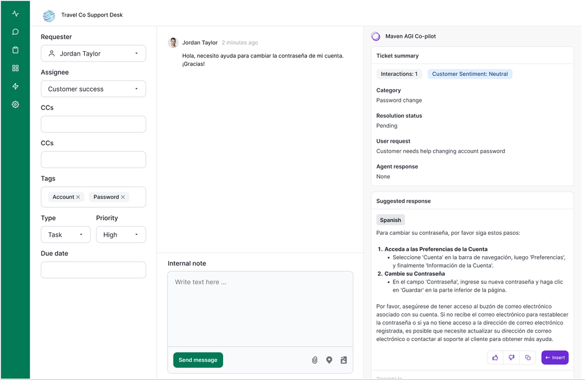

Maven’s multi-language support enables global organizations to handle customer support cases in various languages.

## Maven’s Multi-Language Co-pilot Support

The Maven co-pilot help both non-English and English-only agents to provide high-quality service across multiple languages. Here’s how it works:

* **Universal Translation:** Maven’s Co-Pilot can translate support tickets written in any language into the agent’s default language, allowing English-only agents to respond to tickets in multiple languages. This is particularly useful for organizations that primarily operate in English but need to support customers worldwide.
* **Localized UI:** The user interfaces of Maven’s Co-Pilot are localized for non-English users, making the platform accessible in various languages. This includes toggling between ticket language and the agent’s default language for seamless communication.
* **Knowledge Base Integration:** When a question is asked in a non-English language, Maven prioritizes retrieving relevant documents in the same language. If no such documents exist, Maven will translate content from other languages, such as English, to match the query.
* **Agent Language Flexibility:** Agents can work in their preferred language, while the system supports translation of both the tickets and the responses to ensure accuracy in all communications.

## Maven’s Multi-Language Chat Support

Maven's self service experences (chat, search, slack, etc) have multi-language support. When a user asks a questions, all answers, followups, and actions are translated into the user's language. Here is how it works:

* **Localized UI:** The user interfaces of Maven’s chat are localized for non-English users (typically as a configuration).​ 
* **Knowledge Base Integration:** When a question is asked in a non-English language, Maven prioritizes retrieving relevant documents in the same language. If no such documents exist, Maven will translate content from other languages, such as English, to match the query.

## Languages Supported

| **Language**           | **Chat Supprt** | **UI Support** |
| -----------------------| :--------------: | :--------------: |
| Albanian |  :white_check_mark: | |
| Amharic |  :white_check_mark: | |
| Arabic |  :white_check_mark: | |
| Armenian |  :white_check_mark: | |
| Bengali |  :white_check_mark: | |
| Bosnian |  :white_check_mark: | |
| Bulgarian |  :white_check_mark: | |
| Burmese |  :white_check_mark: | |
| Catalan |  :white_check_mark: | |
| Chinese |  :white_check_mark: | |
| Croatian |  :white_check_mark: | |
| Czech |  :white_check_mark: | |
| Danish |  :white_check_mark: | |
| Dutch |  :white_check_mark: | |
| English | :white_check_mark: | :white_check_mark: |
| Estonian |  :white_check_mark: | |
| Finnish |  :white_check_mark: | |
| French |  :white_check_mark: | :white_check_mark: |
| Georgian |  :white_check_mark: | |
| German |  :white_check_mark: | |
| Greek |  :white_check_mark: | |
| Gujarati |  :white_check_mark: | |
| Hindi |  :white_check_mark: | |
| Hungarian |  :white_check_mark: | |
| Icelandic |  :white_check_mark: | |
| Indonesian |  :white_check_mark: | |
| Italian |  :white_check_mark: | :white_check_mark:  |
| Japanese |  :white_check_mark: | |
| Kannada |  :white_check_mark: | |
| Kazakh |  :white_check_mark: | |
| Korean |  :white_check_mark: | |
| Latvian |  :white_check_mark: | |
| Lithuanian |  :white_check_mark: | |
| Macedonian |  :white_check_mark: | |
| Malay |  :white_check_mark: | |
| Malayalam |  :white_check_mark: | |
| Marathi |  :white_check_mark: | |
| Mongolian |  :white_check_mark: | |
| Norwegian |  :white_check_mark: | |
| Persian |  :white_check_mark: | |
| Polish |  :white_check_mark: | |
| Portuguese |  :white_check_mark: | |
| Punjabi |  :white_check_mark: | |
| Romanian |  :white_check_mark: | |
| Russian |  :white_check_mark: | |
| Serbian |  :white_check_mark: | |
| Slovak |  :white_check_mark: | |
| Slovenian |  :white_check_mark: | |
| Somali |  :white_check_mark: | |
| Spanish |  :white_check_mark: | :white_check_mark: |
| Swahili |  :white_check_mark: | |
| Swedish |  :white_check_mark: | |
| Tagalog |  :white_check_mark: | |
| Tamil |  :white_check_mark: | |
| Telugu |  :white_check_mark: | |
| Thai |  :white_check_mark: | |
| Turkish |  :white_check_mark: | |
| Ukrainian |  :white_check_mark: | |
| Urdu |  :white_check_mark: | |
| Vietnamese |  :white_check_mark: | |

If you need an additional language support, please reach out.

## Maven’s Multi-Language Knowledge Base

Maven prioritizes the user’s preferred language. If a document is available in the user's language, it will be shown; otherwise, the organization’s default language is used. Detecting document language is handled by an Azure service, and duplicates across languages are not considered an issue, as it is assumed that translations are available in multiple languages. The system is designed to prevent duplicate document issues by filtering by user language first. Thus, deactivating foreign language documents for demos is unnecessary.

