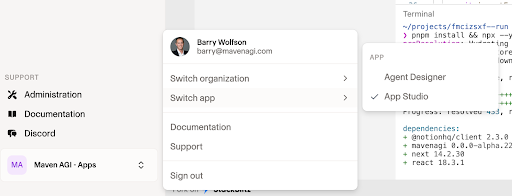
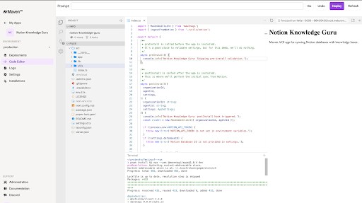

This guide covers how to set up a development workflow which allows for testing changes to Maven apps in a staging environment prior to deploying the changes into production agent environments. This workflow uses two separate GitHub repositories and Maven apps, each linked to a separate Maven agent.

---

## Overview

The staging-to-production workflow uses **two separate Maven apps**, each managed in its own GitHub repository and deployed independently:

- **`acme-staging`**  
  This repository contains your **staging Maven app**, used for development and testing.  
  It is installed on your organization's **staging Maven agent**.

- **`acme-production`**  
  This repository contains your **production Maven app**, used in live customer-facing environments.  
  It is installed on your organization's **production Maven agent**.

> **Prerequisites**: Before setting up this workflow, you should have already completed the initial setup process described in the [Getting Started Guide for Developers](./getting-started-guide-for-developers.mdx), including creating your first repository from the Maven AGI template and working with your Maven contact to configure it.

---

## Step-by-Step Workflow

### 1. Set Up Development Repository

If you don't yet have a development repository set up, work with your Maven contact to:

1. **Fork Your Production Repository**
   Create a fork of your production repository as a new repository (e.g., `acme-staging`)

2. **Configure the Development App**
   Your Maven contact will create a new Maven app in App Studio and configure it to use your development repository

3. **Install GitHub App**
   Ensure the Maven AGI GitHub app is installed on your development repository

### 2. Clone the Development Repo

```bash
git clone git@github.com:your-org/acme-staging.git
cd acme-staging
pnpm install
```

### 3. Create a Feature Branch

```bash
git checkout -b new-feature-branch
```

While no automatic testing or CI/CD will be triggered by pushes to feature branches, PRs are suggested to share contributions amongst team members and organize changes to the repository over time as your Maven application evolves.

### 4. Set Up Local Development

* Create a `.env.local` with required secrets
* Build and test locally using:

  ```bash
  pnpm build
  pnpm test
  pnpm dev
  ```

### 5. Commit and Push

```bash
git add .
git commit -m "feat: add new postback action"
git push origin new-feature-branch
```

### 6. Open a Pull Request

* PR: `new-feature-branch` → `main` in `private-acme-develop`
* Review and merge once approved

### 7. Deploy to Staging

* Changes to `private-acme-develop/main` automatically trigger deployment to your staging Maven agent

### 8. Validate in Staging

* Run tests and verify functionality
* Use **Vitest** for unit testing core functionality
* Push changes to `acme-staging/main` (automatically deploys) and test via your staging agent for integration coverage

Example test patterns are available in [Community Gainsight App Tests](https://github.com/mavenagi-apps/community-gainsight/tree/main/src/__tests__).

### 9. Promote to Production

* Open a PR from `acme-staging/main` → `acme-production/main`
* This is a good time to go through code review with your team if it's part of your workflow
* Once changes are reviewed, merge the PR into `acme-production/main`, which will then automatically trigger a production deployment

### 10. Validate in Production

* Confirm functionality on the live production agent

### 11. Sync Dev with Prod

```bash
git checkout main
git pull upstream main  # Assuming upstream is acme-production
```

Or use GitHub's "Sync fork" button to keep `acme-staging` in sync with `acme-production`

---

## Troubleshooting

### Deployment Issues from GitHub

**Workaround if you hit deployment issues from GitHub**: If you encounter any issues with pushed changes triggering deployments, you can also copy your local changes into the web-based App Studio and deploy from there. Here's a couple screenshots showing where App Studio lives in Maven:





---

## Rollback Strategy

* Roll back by reverting the last commit in `acme-production` (this will automatically redeploy the previous version)

---

## Resources

* [Getting Started Guide for Developers](./getting-started-guide-for-developers.mdx) - Basic development setup
* [Maven Developer Docs](https://developers.mavenagi.com/docs/api-reference/overview/authentication) - Reference full API docs
* [Maven Community Apps](https://github.com/mavenagi-apps/community-gainsight/tree/main) - Check community examples
* [Maven Help Center](https://docs.mavenagi.com/home) - Platform documentation and guides
* [Maven Node.js SDK](https://github.com/mavenagi/mavenagi-node) - TypeScript SDK for Maven platform
* [Maven Discord Community](https://discord.mavenagi.com) - Join the developer community

---

Happy building!

– The Maven Developer Relations Team
